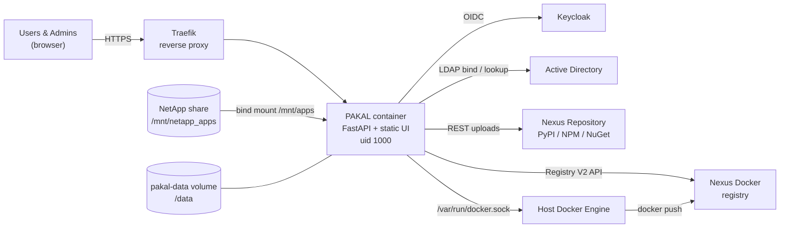

<div align="center">


# PAKAL (פ.ק.ל)

**Package & Application Kit Architecture Layer**

A secure, enterprise-grade DevOps portal that unifies software distribution,
artifact publishing, Docker CI/CD pipelines and dynamic system management -
behind one sign-in.


</div>

---

## Table of contents

- [Overview](#overview)
- [Key features](#key-features)
- [Tech stack](#tech-stack)
- [Architecture & system integration](#architecture--system-integration)
- [Quick start & deployment](#quick-start--deployment)
- [Configuration reference](#configuration-reference)
- [Project directory structure](#project-directory-structure)
- [API surface](#api-surface)
- [Security guidelines](#security-guidelines)
- [Operations](#operations)

---

## Overview

PAKAL is the internal front door for developers and IT staff. From a single bilingual
(Hebrew / English) web portal, users can:

- **Find and download approved software** - installers are discovered automatically on the
  organisation's NetApp share, enriched with icons, versions and descriptions.
- **Install a whole toolchain at once** with role-based bundles delivered as one ZIP archive.
- **Publish artifacts** (Python, NPM, PowerShell / NuGet) to Nexus in bulk.
- **Build and push Docker images** from a plain project ZIP - no local Docker required.
- **Browse the organisational Docker registry** with a Docker Hub-grade experience.

Administrators manage everything - integrations, roles, content and announcements - from a
hidden, database-backed admin console, with no redeploy required.

---

## Key features

### Actions Hub

A landing view with two floating square cards; each opens a dedicated tool with a
**Back to Hub** control and its own deep link (`#actions/nexus`, `#actions/docker`).

| Tool | Highlights |
|---|---|
| **Nexus Artifacts Uploader** | Drag & drop files **or whole folders** (hundreds of packages) &bull; automatic format detection (`.whl` / `.tar.gz` &rarr; PyPI, `.tgz` &rarr; NPM, `.nupkg` &rarr; PowerShell) &bull; per-row target repository with manual override &bull; **Change Target for All Selected** bulk action with live highlight &bull; *Supported formats* reference modal &bull; paginated queue (20 rows + *Show more*) with status filters &bull; concurrent uploads with progress &bull; **Cancel / Abort Upload** via `AbortController` &bull; retry failed and cancelled items |
| **Docker Image Builder** | Drop a project ZIP containing a `Dockerfile` &bull; image name / tag / Dockerfile path inputs with validation &bull; server-side build &rarr; tag &rarr; push to the organisational registry &bull; **live Server-Sent Events log** in a dark interactive terminal (wrap, copy, download, clear) &bull; phase tracker (Upload &rarr; Extract &rarr; Build &rarr; Push &rarr; Clean up) &bull; `.dockerignore` respected &bull; a root `README.md` becomes the image's catalog overview |

### Docker Registry Catalog

A native Docker Hub-style experience, rendered **100% in English and LTR** even when the
rest of the portal is in Hebrew.

- Searchable image catalog backed by the Nexus Docker Registry V2 API.
- Image inspect modal with **Overview**, **Tags** and **Configuration** tabs.
- Copy-ready `docker pull`, `docker run` and `docker-compose.yml` snippets generated from the
  image config.
- Port bindings, volumes, entrypoint / command, labels and environment variables in clean tables.
- **Secrets masking** - variables that look like passwords, tokens or keys are never shown.
- Recommended use-cases inferred from the image, plus the project's **`README.md` rendered as
  safe Markdown** (escape-first renderer, no raw HTML).

### Role-Based Software Bundles

Curated toolchains per role - **Electronics Developer, Software Developer, SysAdmin / NetOps,
Essentials (Infra / Agents)**, Fullstack, DevOps, Data, QA Automation and UI/UX Designer.
Each bundle lists its applications and downloads as **one unified ZIP archive** streamed
directly from the NetApp software share. Bundles are fully editable in the admin console.

### Admin Console & Governance

- Served only from a configurable secret path (`ADMIN_SECURE_PATH`); the well-known `/admin` returns **404**.
- **Database-backed dynamic settings** - Keycloak, LDAP, Nexus, Docker registry, portal tabs
  and feature toggles are edited live and stored in SQLite (values saved in the console win
  over environment seeds).
- **RBAC** - admin rights come from the Keycloak admin role or an LDAP admin group; everyone else
  never sees a link to the console.
- **Emergency fallback authentication** - a local service account that works even when
  Keycloak and LDAP are down. See [`EMERGENCY_ADMIN_README.md`](EMERGENCY_ADMIN_README.md).
- Announcement widget, platform links, catalog curation, app-card file uploads and feedback inbox.

---

## Tech stack

| Layer | Technology |
|---|---|
| Backend | **FastAPI** (Python 3.11), Uvicorn, Pydantic v2, SQLAlchemy 2 |
| Persistence | SQLite settings & catalog database (`/data/pakal.db`), JSON scan cache |
| Identity | **Keycloak** (OpenID Connect, confidential client) and **LDAP / Active Directory** (`ldap3`), bcrypt-hashed local emergency account, signed JWT session cookies |
| Artifacts | **Nexus Repository Manager** REST API (PyPI, NPM, NuGet / PowerShell) |
| Containers | **Docker Engine API** over the host socket `/var/run/docker.sock`; **Nexus Docker Registry V2 API** for the catalog |
| Icons | `icoextract`, `pefile`, `olefile` - icons extracted from EXE / MSI installers |
| Frontend | Dependency-free **Vanilla JS & CSS**, responsive, RTL / LTR adaptive, light & dark themes, self-hosted fonts |
| Delivery | Docker image, Docker Compose, Traefik reverse proxy (TLS) |

---

## Architecture & system integration



**Host Docker socket sharing.** The container runs as an unprivileged user (uid 1000). The host's
`/var/run/docker.sock` is bind-mounted and the container joins the socket's group through
`group_add: ${DOCKER_GID}`. Builds stream the uploaded ZIP into a per-job workspace under
`/data/docker-builds`, call the Engine API to build and tag, push with registry credentials,
and delete the workspace afterwards.

**NetApp storage.** The software share is mounted on the host at `/mnt/netapp_apps` and bind-mounted
into the container at `/mnt/apps` (`APPS_ROOT`). A background scanner indexes installers every
`AUTO_RESCAN_MINUTES`, extracts icons, and serves downloads and bundle ZIPs directly from the share.
Admins can add files to an app folder from the portal, so the container user needs write access.

**Nexus repository management.** Nexus connection details, repositories per format and the Docker
connector are configured in the admin console. Uploads are validated server-side (package
metadata is read from the archive), checked for existing versions, and forwarded to the chosen
repository; the Docker catalog reads the same Nexus through the Registry V2 API.

---

## Quick start & deployment

### Prerequisites

- Docker Engine 24+ with the Compose plugin on a Linux host
- The NetApp software share mounted on the host at `/mnt/netapp_apps`
- An external Docker network named `proxy` shared with Traefik
- Network reachability to Keycloak / LDAP / Nexus (each integration is optional)

### 1. Configure the environment

```bash
cp .env.example .env
chmod 600 .env
# edit .env - registry, host name, Keycloak, LDAP, Nexus ...
```

`.env` is git-ignored. Every value in `.env.example` is a placeholder.

### 2. Allow access to the host Docker socket

The container reaches `/var/run/docker.sock` through the socket's group id:

```bash
stat -c '%g' /var/run/docker.sock      # e.g. 999 (or 998 / 994 depending on the distro)
```

Put the value in `.env`:

```bash
DOCKER_GID=999
```

### 3. Create the emergency admin password

```bash
docker compose run --rm pakal python -m pakal.security hash-password
```

Paste the hash into `.env` **inside single quotes** (it contains `$`):

```bash
ADMIN_PASSWORD_HASH='$2b$12$...'
```

### 4. Build and run

```bash
docker compose build          # or pull the image from ${PAKAL_REGISTRY}
docker compose up -d
docker compose logs -f pakal
```

The portal is served at `https://${PAKAL_HOST}` and the admin console at
`https://${PAKAL_HOST}${ADMIN_SECURE_PATH}`.

### Local development

```bash
python -m venv .venv
. .venv/bin/activate              # Windows: .venv\Scripts\activate
pip install -r requirements.txt
export APPS_ROOT=./test_apps DATA_DIR=./data COOKIE_SECURE=false LOCAL_ADMIN_PASSWORD='choose-a-local-password'
uvicorn main:app --reload --port 8971
```

---

## Configuration reference

All variables are documented in [`.env.example`](.env.example). The most important ones:

| Variable | Purpose | Example |
|---|---|---|
| `PAKAL_REGISTRY` / `PAKAL_VERSION` | Where the portal image is pulled from | `registry.example.com:5000` / `1.8` |
| `PAKAL_HOST` | Public host name (Traefik rule) | `pakal.example.com` |
| `ADMIN_SECURE_PATH` | Secret path of the admin console | `/pakal-management-console` |
| `ADMIN_PASSWORD_HASH` | bcrypt hash of the emergency local admin | `'$2b$12$...'` |
| `DOCKER_GID` | Group id of `/var/run/docker.sock` on the host | `999` |
| `KEYCLOAK_URL`, `KEYCLOAK_CLIENT_SECRET` ... | OIDC single sign-on | `https://keycloak.example.com` |
| `LDAP_URL`, `LDAP_SEARCH_BASE`, `LDAP_ADMIN_GROUP_DN` ... | Directory sign-in and admin group | `ldap://dc01.example.com:389` |
| `NEXUS_URL`, `NEXUS_*_REPO` | Artifact uploader targets | `https://nexus.example.com` |
| `NEXUS_DOCKER_REGISTRY` | Docker catalog & build push target | `nexus.example.com:5000` |
| `DOCKER_BUILD_ADMIN_ONLY` | Restrict image builds to admins | `true` |

> Integration values (Keycloak, LDAP, Nexus, Docker) only **seed** the admin console. Once saved
> in the console they are stored in the database and take precedence.

---

## Project directory structure

```text
.
├── main.py                     # ASGI entry point (uvicorn main:app)
├── Dockerfile                  # python:3.11-slim, non-root uid 1000, healthcheck
├── docker-compose.yml          # Traefik labels, socket + NetApp mounts, env from .env
├── requirements.txt
├── .env.example                # configuration template (placeholders only)
├── EMERGENCY_ADMIN_README.md   # break-glass admin access runbook
├── pakal/
│   ├── app.py                  # app factory, security headers / CSP, lifespan tasks
│   ├── config.py               # environment configuration
│   ├── db.py, models.py        # SQLite schema, settings store, seeding & migrations
│   ├── schemas.py              # Pydantic request / response models
│   ├── security.py             # sessions, bcrypt, CSRF header, rate limiting
│   ├── auth_config.py          # DB-backed integration settings (env as seed)
│   ├── sso.py                  # Keycloak OIDC client
│   ├── directory.py            # LDAP / Active Directory
│   ├── scanner.py, store.py    # NetApp share scanner and in-memory catalog
│   ├── icons.py, knowledge.py  # icon extraction, known apps, bundles, platforms
│   ├── portal_ui.py            # portal tabs, feature toggles, announcements
│   ├── nexus.py                # package inspection and Nexus uploads
│   ├── docker_registry.py      # Registry V2 catalog, image config, README store
│   ├── docker_build.py         # ZIP-to-image build jobs via the Engine API
│   ├── routes_public.py        # catalog, downloads, bundle ZIPs, health
│   ├── routes_auth.py          # SSO / LDAP login, session, feedback
│   ├── routes_actions.py       # Nexus uploader API
│   ├── routes_docker.py        # registry catalog + build-and-push (SSE)
│   ├── routes_manage.py        # admin file uploads to app folders
│   └── routes_admin.py         # admin console API
└── static/
    ├── index.html, app.js, style.css      # portal (Hebrew RTL / English LTR)
    ├── docker.js                          # Docker catalog & image builder (English LTR)
    ├── admin.html, admin.js, admin.css    # admin console
    ├── common.js, theme.js                # shared helpers, icons, theme bootstrap
    ├── fonts/                             # self-hosted Heebo, Inter, JetBrains Mono
    └── icons/                             # built-in application icons (SVG)
```

---

## API surface

| Area | Endpoints |
|---|---|
| Catalog | `GET /api/apps`, `GET /api/apps/{id}`, `GET /api/icon/{id}`, `GET /api/download/{path}`, `GET /api/bundles/{id}/download-zip`, `GET /api/ui`, `GET /api/status`, `GET /api/health` |
| Auth | `GET /api/auth/sso/login`, `GET /api/auth/sso/callback`, `POST /api/auth/ldap/login`, `GET /api/auth/me`, `POST /api/auth/logout`, `POST /api/feedback` |
| Actions | `GET /api/actions/config`, `PUT /api/actions/upload` |
| Docker | `GET /api/docker/config`, `GET /api/docker/images`, `GET /api/docker/image`, `POST /api/docker/build-and-push` *(SSE stream)* |
| Admin | `/api/admin/*` (session + admin role required), `PUT /api/manage/apps/{id}/files` |

State-changing requests must send the `X-PAKAL-Request: 1` header (CSRF protection).

---

## Security guidelines

| Area | Policy |
|---|---|
| **Secrets** | Real values live only in `.env` (git-ignored, `chmod 600`). The code ships **no default passwords or hashes** - without `ADMIN_PASSWORD_HASH` the emergency login is disabled. Integration secrets saved in the console are stored server-side and never returned to the browser. |
| **RBAC** | Admin rights come from the Keycloak admin role or the LDAP admin group. The console is served only at `ADMIN_SECURE_PATH`; `/admin` returns 404 and admin responses carry `noindex`. |
| **Docker socket** | Access to `/var/run/docker.sock` is **root-equivalent on the host**. Builds are **admin-only by default** (`DOCKER_BUILD_ADMIN_ONLY=true`) - relax this only if every signed-in user is trusted. The container itself runs as a non-root user that only joins the socket group. Build contexts are size-limited, extracted safely (no path traversal or symlink escapes) and deleted after each job. |
| **Web hardening** | Strict Content-Security-Policy (`'self'` only), `X-Frame-Options: DENY`, `nosniff`, same-origin referrer and opener policies, sandboxed CSP for user-uploaded content, CSRF header on every mutation, rate-limited logins, secure cookies behind TLS. |
| **Uploads** | Package type, metadata and size are validated server-side before anything is forwarded to Nexus. |
| **Emergency access** | Follow [`EMERGENCY_ADMIN_README.md`](EMERGENCY_ADMIN_README.md). Keep the emergency password in the team vault, audit `Admin login (local)` log lines after use, and rotate the password whenever it may have been shared. |

---

## Operations

```bash
docker compose ps                                   # health status
docker compose logs -f pakal                        # live logs
docker compose pull && docker compose up -d         # upgrade to ${PAKAL_VERSION}
docker compose up -d --force-recreate pakal         # re-read .env
docker exec pakal_appstore printenv ADMIN_SECURE_PATH
```

Persistent state (settings database, scan cache, extracted icons, uploads) lives in the
`pakal-data` volume mounted at `/data` - include it in your backups.
